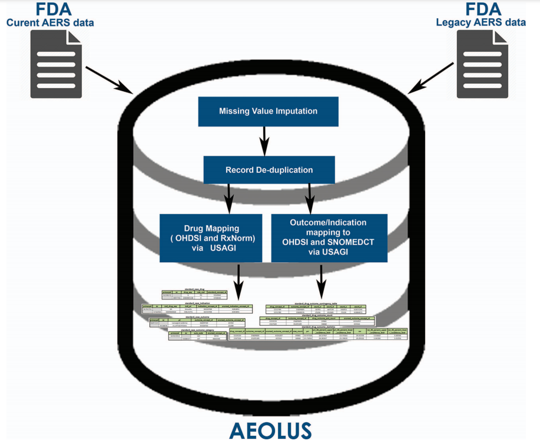
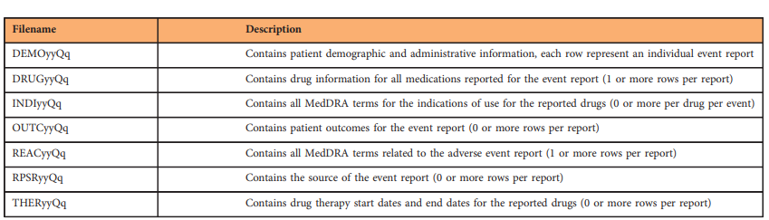

# ML-Adverse Pharmaceuticals Events
Analyze Adverse Pharmaceuticals Events

Table of content
- [Task](#task)  
- [Keggle](#keggle)  

## Task
Find which drugs cause Advers Pharmaceutical events
Still need to be determent more exactly

Tasks

- [ ] Where is data
- [ ] How to access data
- [ ] Exploratory Data analysis (Check what can I predict, where ML can be used)

## Keggle
sorce: https://www.kaggle.com/fda/adverse-pharmaceuticals-events

### Context:
Identification of adverse drug reactions (ADRs) during the post-marketing phase is one of the most important goals of drug safety surveillance. Spontaneous reporting systems (SRS) data, which are the mainstay of traditional drug safety surveillance, are used for hypothesis generation and to validate the newer approaches. The publicly available US Food and Drug Administration (FDA) Adverse Event Reporting System (FAERS) data requires substantial curation before they can be used appropriately, and applying different strategies for data cleaning and normalization can have material impact on analysis results.

### Content:
We provide a curated and standardized version of FAERS removing duplicate case records, applying standardized vocabularies with drug names mapped to RxNorm concepts and outcomes mapped to SNOMED-CT concepts, and pre-computed summary statistics about drug-outcome relationships for general consumption. This publicly available resource, along with the source code, will accelerate drug safety research by reducing the amount of time spent performing data management on the source FAERS reports, improving the quality of the underlying data, and enabling standardized analyses using common vocabularies.

### Acknowledgements:
Data available from [this source](http://datadryad.org/resource/doi:10.5061/dryad.8q0s4).

When using this data, please cite the original publication:

Banda JM, Evans L, Vanguri RS, Tatonetti NP, Ryan PB, Shah NH (2016) A curated and standardized adverse drug event resource to accelerate drug safety research. Scientific Data 3: 160026. http://dx.doi.org/10.1038/sdata.2016.26

Additionally, please cite the Dryad data package:

Banda JM, Evans L, Vanguri RS, Tatonetti NP, Ryan PB, Shah NH (2016) Data from: A curated and standardized adverse drug event resource to accelerate drug safety research. Dryad Digital Repository. http://dx.doi.org/10.5061/dryad.8q0s4

### Inspiration:
This is a large-ish dataset (~4.5 gb uncompressed), so try out your batch processing skills in a Kernel
What groups of drugs are most risky?
What medical conditions are most at risk to drug-associated risks?

## Data access

Data can be accessed on [AEOLUS](https://datadryad.org/stash/dataset/doi:10.5061/dryad.8q0s4) as it said on kaggle.
The data is from 2015. 

#### Summary of artice
In the article is already prepared data for downloading and also code so I will be able to update data 
to the latest version and do cleanup steps.

Data on FDA's webside is updarted quarterly in CSV or XML format.

Data starts from 2004. From 2004 to 2012 there is different format (Legacy AERS data) as from 2012 on (Curent AERS data). 
It the time of above article the data was till 2015. The main difference is in renaming of key fields: "isr" and "case"
to primaryid and caseid respectivly.

You need to download and extract each quarterly FEARS/LEARS data file and then impute missing values and 
delete duplicates. The data is then devided in 7 tables as shown in the image belowe.

NEXT
[ ] Data merging page 3/11

# TO DO
- [ ] Read the article of this data https://datadryad.org/stash/dataset/doi:10.5061/dryad.8q0s4
- [ ] Check [FAERS](https://open.fda.gov/data/faers/#:~:text=About%20FAERS-,The%20FDA%20Adverse%20Event%20Reporting%20System%20(FAERS)%20is%20a%20database,drug%20and%20therapeutic%20biologic%20products.)
official site for new version of data